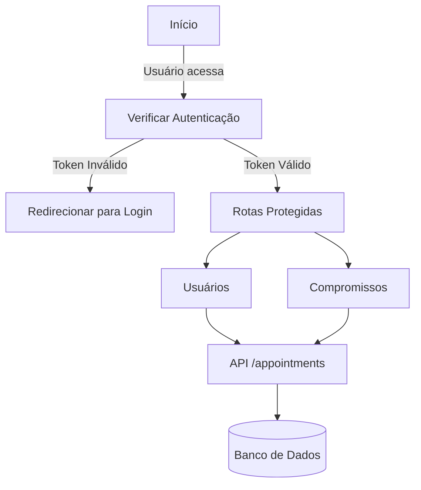

# 📚 Node API com Frontend Next.js, Prisma, Docker e Testes

Bem-vindo à Node API! Este projeto gerencia usuários e compromissos, usando Fastify, TypeScript, Next.js, Prisma, PostgreSQL e Vitest. O backend e frontend são totalmente containerizados com Docker para facilitar o desenvolvimento e a execução.

---

## 🚀 Funcionalidades

### 🧑‍💻 Usuários

- **Listar usuários**: Retorna todos os usuários cadastrados.
- **Criar usuário**: Adiciona novos usuários com nome, e-mail, senha, idade e status de administrador.
- **Atualizar usuário**: Edita informações de um usuário existente.
- **Deletar usuário**: Remove usuários do sistema.
- **Autenticação JWT**: Login protegido e rotas seguras via token.

### 📅 Compromissos

- **Criar compromissos**: Agenda compromissos vinculados a usuários.
- **Validação de datas**: Garante que o início seja no futuro e o término após o início.
- **Filtro por usuário/data**: Listagem filtrada por usuário, cliente ou intervalo de datas.
- **Validação de sobreposição**: Não permite compromissos sobrepostos para o mesmo usuário.

---

## 🛠️ Tecnologias

- **Node.js** e **Fastify**
- **TypeScript**
- **Next.js** (Frontend)
- **Prisma** (ORM)
- **PostgreSQL**
- **Docker** e **Docker Compose**
- **Vitest** (Testes)
- **@faker-js/faker** (Dados fake para testes)
- **dotenv** (Variáveis de ambiente)
- **Supertest** (Testes de rotas)

---

## 📂 Estrutura do Projeto

```plaintext
node_api/
├── backend/
│   ├── prisma/
│   │   ├── migrations/
│   │   └── schema.prisma
│   ├── src/
│   │   ├── controllers/
│   │   ├── routes/
│   │   ├── services/
│   │   ├── schemas/
│   │   ├── entities/
│   │   ├── tests/
│   │   │   └── factories/
│   │   ├── server.ts
│   │   └── types.ts
│   ├── Dockerfile
│   ├── package.json
│   └── tsconfig.json
├── frontend/
│   ├── src/
│   │   ├── app/
│   │   ├── components/
│   │   └── styles/
│   ├── Dockerfile
│   ├── package.json
│   └── tsconfig.json
├── database/
│   ├── docker-compose.prod.yml
│   └── init.sql
├── docker-compose.yml
├── .env
└── README.md
```

---

## 🐳 Docker

O projeto usa **Docker Compose** para orquestrar backend, frontend e banco de dados.

- **Backend:** Fastify na porta `3333`
- **Frontend:** Next.js na porta `3000`
- **PostgreSQL:** Porta `5433`

**Como rodar:**

```bash
git clone https://github.com/seu-usuario/seu-repositorio.git
cd node_api
docker-compose up --build
```

Acesse:

- Backend: [http://localhost:3333](http://localhost:3333)
- Frontend: [http://localhost:3000](http://localhost:3000)

---

## 🗂️ Endpoints Principais

### **Usuários**

- `GET /users` — Lista usuários
- `POST /users` — Cria usuário
- `PUT /users/:id` — Atualiza usuário
- `DELETE /users/:id` — Remove usuário
- `POST /login` — Autenticação JWT

### **Compromissos**

- `GET /appointments` — Lista compromissos (filtros: userId, customer, startsAt, endsAt)
- `POST /appointments` — Cria compromisso
- `PUT /appointments/:id` — Atualiza compromisso
- `DELETE /appointments/:id` — Remove compromisso

---

## 🖥️ Frontend

- Lista usuários e compromissos consumindo a API.
- Dashboard acessível em [http://localhost:3000](http://localhost:3000).

---

## 🧪 Testes

- Testes unitários e de integração com **Vitest** e **Supertest**.
- Dados fake gerados com **@faker-js/faker**.
- Para rodar os testes:
  ```bash
  pnpm test
  ```
- Para abrir o relatório de cobertura:
  ```bash
  xdg-open ./coverage/index.html
  ```

---

## 🛠️ Desenvolvimento Local

**Backend:**

```bash
cd backend
pnpm install
pnpm dev
```

**Frontend:**

```bash
cd frontend
pnpm install
pnpm dev
```

---

## 📊 Fluxo da Aplicação



---

## 🐛 Solução de Problemas

- **Porta em uso:** Encerre processos com `lsof -i :3333` e `kill -9 <PID>`
- **Erro de CORS:** Configure o backend:
  ```typescript
  app.register(cors, { origin: "http://localhost:3000" });
  ```
- **Banco não conecta:** Verifique se o container do PostgreSQL está rodando.

---

## 📜 Licença

MIT

---

## 📞 Contato

- **Email:** taisazevedo9@gmail.com
- **GitHub:** [taisazevedo9](https://github.com/taisazevedo9)
