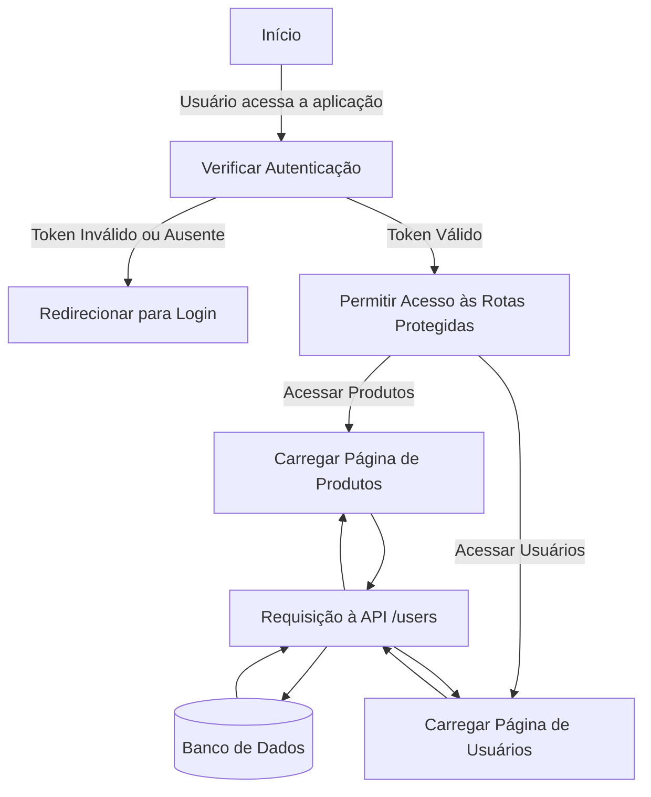

# 📚 Node API com Frontend Next.js, Prisma e Docker

Bem-vindo à Node API, uma aplicação desenvolvida para gerenciar usuários e compromissos, utilizando tecnologias modernas como Fastify, TypeScript, Next.js, Prisma e PostgreSQL. O projeto está totalmente containerizado com Docker para facilitar a execução e o desenvolvimento.

---

## 🚀 Funcionalidades

### 🧑‍💻 Gerenciamento de Usuários

- **Listar usuários**: Obtenha uma lista de todos os usuários cadastrados.
- **Criar usuário**: Adicione novos usuários com informações como nome, e-mail, senha, idade e status de administrador.
- **Atualizar usuário**: Edite informações de um usuário existente.
- **Deletar usuário**: Remova usuários do sistema.

### 📅 Gerenciamento de Compromissos

- **Criar compromissos**: Agende compromissos com validação de sobreposição de datas.
- **Validação de datas**: Garante que a data de início seja no futuro e que a data de término seja posterior à data de início.

---

## 🛠️ Tecnologias Utilizadas

- **Node.js**: Plataforma para execução do JavaScript no servidor.
- **Fastify**: Framework web rápido e eficiente.
- **TypeScript**: Superset do JavaScript que adiciona tipagem estática.
- **Next.js**: Framework React para o frontend.
- **Prisma**: ORM para modelagem e interação com o banco de dados.
- **PostgreSQL**: Banco de dados relacional utilizado para persistência.
- **Docker**: Containerização para facilitar o desenvolvimento e a execução.
- **Vitest**: Framework de testes para garantir a qualidade do código.
- **dotenv**: Gerenciamento de variáveis de ambiente.

---

## 📂 Estrutura do Projeto

```plaintext
node_api/
├── backend/                     # Backend (API)
│   ├── prisma/                  # Arquivos do Prisma
│   │   ├── migrations/          # Histórico de migrações
│   │   └── schema.prisma        # Definição do esquema do banco de dados
│   ├── src/                     # Código-fonte do backend
│   │   ├── routes/              # Rotas da API
│   │   │   ├── users.routes.ts  # Rotas relacionadas a usuários
│   │   │   ├── appointments.routes.ts # Rotas relacionadas a compromissos
│   │   │   └── index.ts         # Registro central de rotas
│   │   ├── database/            # Configuração do banco de dados
│   │   │   └── database-postgres.ts # Classe para interagir com o banco
│   │   ├── server.ts            # Inicialização do servidor Fastify
│   │   └── types.ts             # Tipos personalizados
│   ├── Dockerfile               # Dockerfile para o backend
│   ├── package.json             # Dependências e scripts do backend
│   ├── pnpm-lock.yaml           # Arquivo de lock do PNPM
│   └── tsconfig.json            # Configuração do TypeScript
├── frontend/                    # Frontend (Next.js)
│   ├── public/                  # Arquivos estáticos
│   ├── src/                     # Código-fonte do frontend
│   │   ├── app/                 # Estrutura de rotas do Next.js
│   │   │   ├── users/           # Página de usuários
│   │   │   ├── appointments/    # Página de compromissos
│   │   │   └── index.tsx        # Página inicial
│   │   ├── components/          # Componentes reutilizáveis
│   │   └── styles/              # Estilos globais
│   ├── Dockerfile               # Dockerfile para o frontend
│   ├── package.json             # Dependências e scripts do frontend
│   ├── pnpm-lock.yaml           # Arquivo de lock do PNPM
│   └── tsconfig.json            # Configuração do TypeScript
├── database/                    # Configuração do banco de dados
│   ├── docker-compose.prod.yml  # Configuração do banco em produção
│   └── init.sql                 # Script de inicialização do banco
├── docker-compose.yml           # Orquestração dos serviços em desenvolvimento
├── docker-compose.prod.yml      # Orquestração dos serviços em produção
├── README.md                    # Documentação do projeto
└── .env                         # Variáveis de ambiente
```

---

## 🐳 Configuração com Docker

O projeto utiliza **Docker Compose** para orquestrar os serviços do backend, frontend e banco de dados.

### Serviços configurados:

- **Backend**: API desenvolvida com Node.js e Fastify, rodando na porta `3333`.
- **Frontend**: Aplicação Next.js para consumir a API, rodando na porta `3000`.
- **PostgreSQL**: Banco de dados relacional, rodando na porta `5433`.

### Como rodar o projeto com Docker:

1. **Clone o repositório:**

   ```bash
   git clone https://github.com/seu-usuario/seu-repositorio.git
   cd node_api
   ```

2. **Suba os containers com Docker Compose:**

   ```bash
   docker-compose up --build
   ```

3. **Acesse os serviços:**
   - **Backend:** `http://localhost:3333`
   - **Frontend:** `http://localhost:3000`

---

## 🗂️ Endpoints da API

### **GET /users**

Retorna uma lista de usuários.

**Exemplo de resposta:**

```json
[
  { "id": 1, "name": "User1" },
  { "id": 2, "name": "User2" }
]
```

---

## 🖥️ Funcionalidades do Frontend

- Exibe uma lista de usuários consumida do backend.
- Página de dashboard acessível em `http://localhost:3000`.

---

## 🛠️ Desenvolvimento Local

### Rodar o backend localmente

1. Entre na pasta

backend

:

```bash
cd backend
```

2. Instale as dependências:
   ```bash
   pnpm install
   ```
3. Inicie o servidor:
   ```bash
   pnpm dev
   ```

### Rodar o frontend localmente

1. Entre na pasta

frontend

:

```bash
cd frontend
```

2. Instale as dependências:
   ```bash
   pnpm install
   ```
3. Inicie o servidor:
   ```bash
   pnpm dev
   ```

---

---

## 📊 Fluxo da Aplicação

Abaixo está um diagrama representando o fluxo mais importante da aplicação, desde a autenticação até o acesso às rotas protegidas.



## 🐛 Solução de Problemas

### Container do backend caindo

- Verifique os logs do container:
  ```bash
  docker logs node_api-backend-1
  ```
- Certifique-se de que o banco de dados está rodando corretamente.

### Erro de CORS

- Certifique-se de que o CORS está configurado no backend:
  ```typescript
  app.register(cors, { origin: "http://localhost:3000" });
  ```

---

## 📜 Licença

Este projeto está sob a licença **MIT**. Sinta-se à vontade para usá-lo e modificá-lo.

---

## 📞 Contato

Se você tiver dúvidas ou sugestões, entre em contato:

- **Email:** taisazevedo9@gmail.com
- **GitHub:** [taisazevedo9](https://github.com/taisazevedo9)
